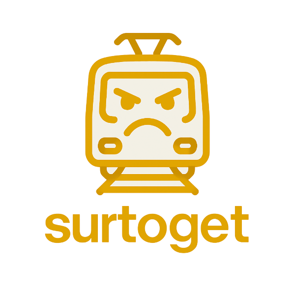

<p align="center">
  
</p>

Ah, Sørlandsbanen. The train line that makes you question your life choices.
If you've ever found yourself stranded in the middle of nowhere, wondering why
you didn't just take the bus, this project is for you.

Surtoget is a place to share your pain, laugh at the absurdity of it all,
and maybe, just maybe, find some solidarity in our shared suffering.

Feel free to check out the website here: [surtoget.no](https://surtoget.no)

## Prerequisites

To run this project, you need:

- [Gleam](https://gleam.run/getting-started/installing/)
- [Node.js](https://nodejs.org/en/download/) and [npm](https://www.npmjs.com/get-npm)

## Development

First, install the Node.js dependencies for Tailwind CSS:

```sh
npm install
```

Then you need to generate the actual CSS for Tailwind:

```sh
 npx tailwindcss -o ./priv/css/tailwind.css && gzip -k -f ./priv/css/tailwind.css
```

If you have [Gleam](https://gleam.run/getting-started/installing/) installed, you can use the `gleam` CLI to start a new project:

```sh
gleam new --template=surtoget my_app
cd my_app
gleam run
```

The easiest approach is to use the make commands to run the server:

```sh
make run
```

This command will:

1. Format the Gleam code.
2. Generate the Tailwind CSS file (`./priv/css/tailwind.css`).
3. Start the Gleam server.

When the server starts it starts on port 8000 and can be reached on:
[localhost:8000](http://localhost:8000)

## Credits

- News placeholder photo is created by [Raquel Candia](https://pixabay.com/users/ideativas-tlm-19346105/?utm_source=link-attribution&utm_medium=referral&utm_campaign=image&utm_content=8316054)
